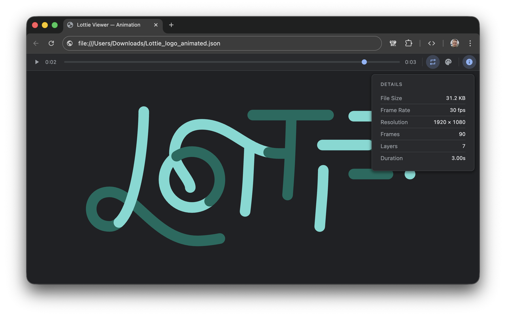

# Lottie Viewer Google Chrome Extension

A Chrome extension that automatically detects Lottie animation files (.json, .lottie) opened in the browser and replaces the raw JSON with an interactive animation player.

## Features

- **Instant detection** — automatically recognizes Lottie JSON files opened from local files or URLs
- **Playback controls** — play, pause, and scrub through animations with a timeline slider
- **Loop toggle** — enable or disable looping
- **Details panel** — view file size, frame rate, resolution, frame count, layer count, and duration
- **Background color picker** — choose from presets, use the color picker, or enter a hex value
- **Dark mode support** — automatically adapts to your system theme
- **Lightweight** — no external services, everything runs locally in your browser

## Installation

### From Chrome Web Store

Coming soon.

### Manual Install

1. Download or clone this repository
2. Open `chrome://extensions/` in Chrome
3. Enable **Developer mode** (top right)
4. Click **Load unpacked** and select the project folder

## Usage

1. Open any Lottie JSON file in Chrome — drag a `.json` file into the browser or navigate to a URL
2. The viewer automatically replaces the raw JSON with an animation player
3. Use the toolbar to control playback, toggle looping, change the background color, or view animation details

## License

MIT
